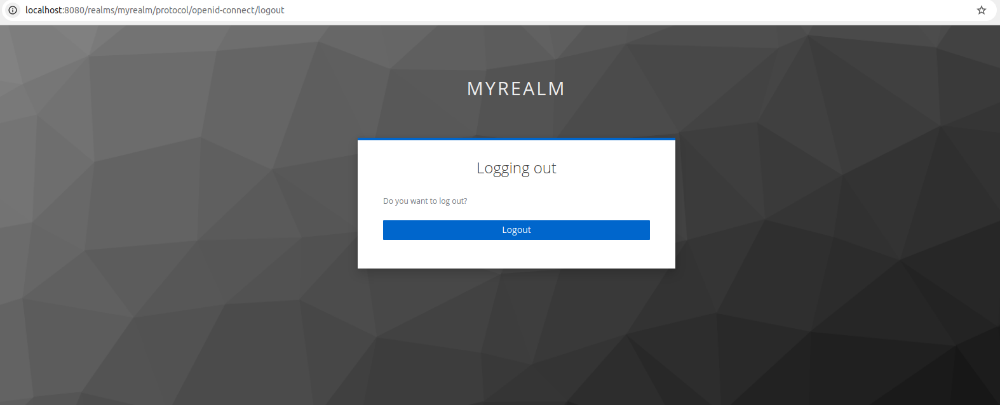
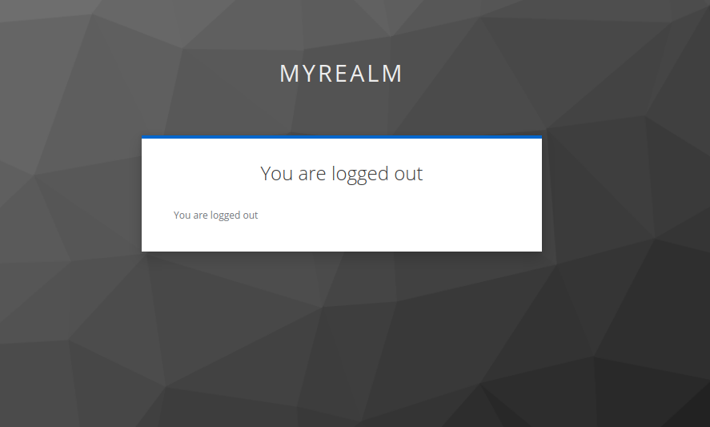
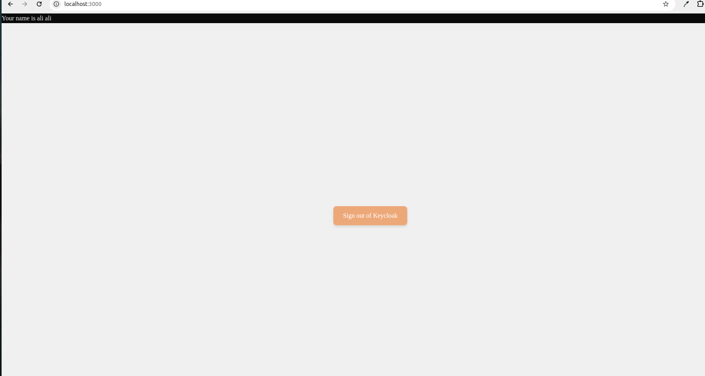
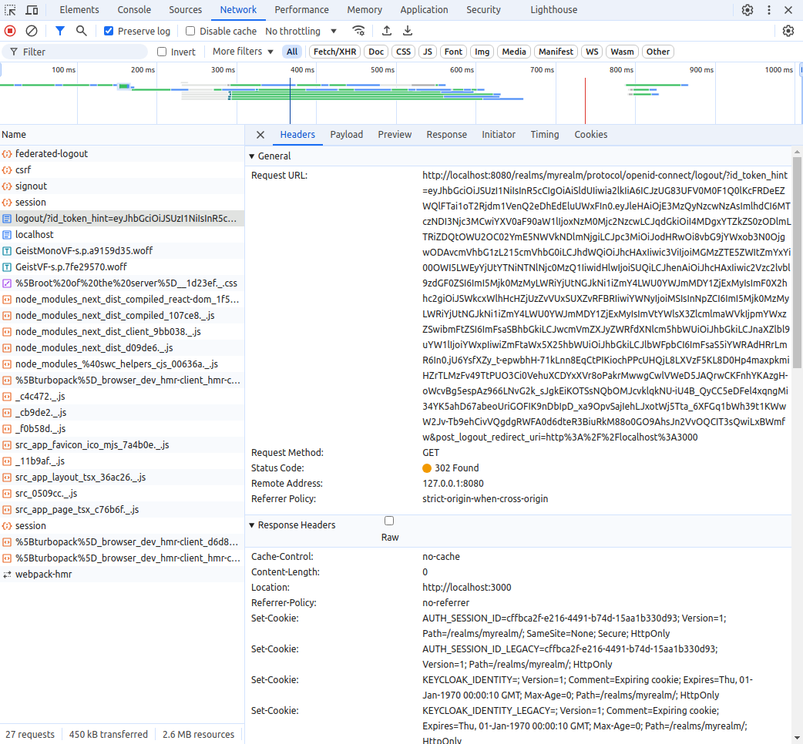

## Getting Started

## **1- Create you project :** 

npx create-next-app@latest 


## **2- Version requirements:** (to avoid compatibility problem)

```bash
"next": "15.0.4"
```

## **3- install package next-auth:**

npm install next-auth


## **4- Configure the authOptions with KeycloakProvider for next-auth and initialize route handler.**

Create a file with the following command from the root of the project.

```bash
mkdir -p "src/app/api/auth/[...nextauth]" && touch "src/app/api/auth/[...nextauth]/route.ts"
```


Add the following code to the file created. This will configure Keycloak provider from the environment variables.

```bash 
// src/app/api/auth/[...nextauth]/route.ts
import NextAuth, { AuthOptions } from "next-auth";
import KeycloakProvider from "next-auth/providers/keycloak"
  
export const authOptions: AuthOptions = {
    providers: [
        KeycloakProvider({
            clientId: process.env.KEYCLOAK_CLIENT_ID,
            clientSecret: process.env.KEYCLOAK_CLIENT_SECRET,
            issuer: process.env.KEYCLOAK_ISSUER
        })
    ]
}

const handler = NextAuth(authOptions);
export { handler as GET, handler as POST }
```


## **5- Create a file with the following command from the root of project.**
```bash 
mkdir types && touch types/node-env.d.ts
```


Extend the ProcessEnv interface with the following code.

```bash 
// types/node-env.d.ts
declare namespace NodeJS {
  export interface ProcessEnv {
    KEYCLOAK_CLIENT_ID: string
    KEYCLOAK_CLIENT_SECRET: string
    KEYCLOAK_ISSUER: string
  }
}
```
## **6- Add the environment variables to a file named ''.env.local''**  
Which will be automatically picked up by the Nextjs server.

```bash 
touch .env.local
```

```bash
KEYCLOAK_CLIENT_ID="nextjs"
KEYCLOAK_CLIENT_SECRET="<client_secret>"
KEYCLOAK_ISSUER="http://localhost:8080/realms/myrealm"
```
- Replace the values **nextjs** with the id client egiste in keycloak interface.
- Replace the values **<client_secret>** with the key generete in keycloak interface in client.

We also need to configure **NEXTAUTH_URL** and **NEXTAUTH_SECRET**. These are essential for configuring of "next-auth". To know more, check the guide. Let’s add following environment variables to **.env.local**.

```bash 
// .env.local
...
...
NEXTAUTH_URL="http://localhost:3000"
```
For NEXTAUTH_SECRET, create a secret by running the following command and add it to .env.local. This secret is used to sign and encrypt cookies.

```bash 
openssl rand -base64 32
```

```bash 
// .env.local
...
...
...
NEXTAUTH_SECRET="<secret generated from previous command>"
```

## **7- Add components**

Create a folder in src named **components** 

- create the **login** and **logout** component by creating the following files.

```bash 
mkdir src/components &&  touch src/components/login.tsx && touch src/components/logout.tsx
```
- Add the following contents to **login** and **logout** component.

```bash 
// src/components/login.tsx
"use client";
import { signIn } from "next-auth/react";

export default function Login() {
    return (
        <div
            style={{
                display: "flex",
                justifyContent: "center",
                alignItems: "center",
                height: "100vh",
                backgroundColor: "#f0f0f0"
            }}
        >
            <button
                onClick={() => signIn("keycloak")}
                style={{
                    backgroundColor: "#206fba",
                    color: "#fff",
                    border: "none",
                    padding: "12px 24px",
                    fontSize: "16px",
                    borderRadius: "8px",
                    cursor: "pointer",
                    boxShadow: "0px 4px 6px rgba(0, 0, 0, 0.1)"
                }}
            >
                Sign in with Keycloak
            </button>
        </div>
    );
}

```
```bash
// src/components/logout.tsx
"use client";
import { signOut } from "next-auth/react";

export default function Logout() {
    return (
        <div
            style={{
                display: "flex",
                justifyContent: "center",
                alignItems: "center",
                height: "100vh",
                backgroundColor: "#f0f0f0"
            }}
        >
            <button
                onClick={() => signOut()}
                style={{
                    backgroundColor: "#eda879",
                    color: "#fff",
                    border: "none",
                    padding: "12px 24px",
                    fontSize: "16px",
                    borderRadius: "8px",
                    cursor: "pointer",
                    boxShadow: "0px 4px 6px rgba(0, 0, 0, 0.1)"
                }}
            >
                Sign out of Keycloak
            </button>
        </div>
    );
}
}
```

Let’s do some testing the application.

```bash
npm run dev
```

Go to http://localhost:3000 in browber. You’ll be prompted to sign in with keycloak.


Once you sign in, you will see the name of the account used to sign in, with the logout component.


## **8- Refreshing access token**

Let’s add `jwt` and `session` callbacks to the `authOptions` which will help us store tokens and session metadata.

```bash 
// src/app/api/auth/[...nextauth]/route.ts
export const authOptions: AuthOptions = {
  ...
  ...
  session: {
    maxAge: 60 * 30
  },
  callbacks: {
    async jwt({ token, account }) {
      if (account) {
        token.idToken = account.id_token
        token.accessToken = account.access_token
        token.refreshToken = account.refresh_token
        token.expiresAt = account.expires_at
      }
      return token
    },
    async session({ session, token }) {
      session.accessToken = token.accessToken
      return session
    }
  }
}
```

In a Keycloak-based authentication system, the access token has a short lifespan (typically 5 minutes) and must be renewed before it expires. To facilitate this, the refresh token, which has a longer validity period, is used to obtain new access tokens as needed. Once the refresh token expires, users must re-authenticate. To automate the token renewal process, an API call is set up using client credentials and the refresh token, which requests a new access token from the Keycloak server before the current one expires. This process can be managed efficiently with Next-Auth, ensuring seamless token refresh and continuous access to protected resources.

- We will setup a keycloak API call which would renew access token by taking client credentials and refresh token as input.

```bash 
// src/app/api/auth/[...nextauth]/route.ts
function requestRefreshOfAccessToken(token: JWT) {
  return fetch(`${process.env.KEYCLOAK_ISSUER}/protocol/openid-connect/token`, {
    headers: { "Content-Type": "application/x-www-form-urlencoded" },
    body: new URLSearchParams({
      client_id: process.env.KEYCLOAK_CLIENT_ID,
      client_secret: process.env.KEYCLOAK_CLIENT_SECRET,
      grant_type: "refresh_token",
      refresh_token: token.refreshToken!,
    }),
    method: "POST",
    cache: "no-store"
  });
}
```
We also need to setup the JWT callback in such a way that if access token has not expired we do not perform any action. If an access token is just about to expire(lets take a buffer of 1 minutes before its expiry) we would send the above request to keycloak authorisation server for a new access token.

We might also need to consider that even refresh token can expire, we request the user of the application to redo the process of authenticating with keycloak.

```bash 
// src/app/api/auth/[...nextauth]/route.ts
import { AuthOptions, TokenSet } from "next-auth";
import { JWT } from "next-auth/jwt";
import NextAuth from "next-auth/next";
import KeycloakProvider from "next-auth/providers/keycloak"

function requestRefreshOfAccessToken(token: JWT) {
// ... Discussed in previous step
}

export const authOptions: AuthOptions = {
// ...
  callbacks: {
    async jwt({ token, account }) {
      if (account) {
        token.idToken = account.id_token
        token.accessToken = account.access_token
        token.refreshToken = account.refresh_token
        token.expiresAt = account.expires_at
        return token
      }
      // we take a buffer of one minute(60 * 1000 ms)
      if (Date.now() < (token.expiresAt! * 1000 - 60 * 1000)) {
        return token
      } else {
        try {
          const response = await requestRefreshOfAccessToken(token)

          const tokens: TokenSet = await response.json()

          if (!response.ok) throw tokens

          const updatedToken: JWT = {
            ...token, // Keep the previous token properties
            idToken: tokens.id_token,
            accessToken: tokens.access_token,
            expiresAt: Math.floor(Date.now() / 1000 + (tokens.expires_in as number)),
            refreshToken: tokens.refresh_token ?? token.refreshToken,
          }
          return updatedToken
        } catch (error) {
          console.error("Error refreshing access token", error)
          return { ...token, error: "RefreshAccessTokenError" }
        }
      }
    },
// ...
  }
}

const handler = NextAuth(authOptions);

export { handler as GET, handler as POST }
```

We will wrap our components with a SessionGuard and SessionProvider to trigger the authentication flow in case of a RefreshAccessTokenError. This wrapping will be implemented in the layout component, ensuring that all pages and routes are encompassed by a common root layout with the session guard. The session provider will keep the session alive by polling the Next.js server every 4 minutes, with an additional 1-minute buffer time.

```bash 
// src/app/Providers.tsx
'use client'

import { SessionProvider } from "next-auth/react"
import { ReactNode } from "react"

export function Providers({ children }: { children: ReactNode }) {
  return (
    <SessionProvider refetchInterval={4 * 60}>
      {children}
    </SessionProvider>
  )
}
```
```bash 
// src/components/SessionGuard.tsx
"use client";
import { signIn, useSession } from "next-auth/react";
import { ReactNode, useEffect } from "react";

export default function SessionGuard({ children }: { children: ReactNode }) {
  const { data } = useSession();
  useEffect(() => {
    if (data?.error === "RefreshAccessTokenError") {
      signIn("keycloak");
    }
  }, [data]);

  return <>{children}</>;
}
```
```bash 
// src/app/layout.tsx
import './globals.css'
import { Providers } from './Providers'
import SessionGuard from '@/components/SessionGuard'

// ...

export default function RootLayout({
  children,
}: {
  children: React.ReactNode
}) {
  return (
    <html lang="en">
      <body className={inter.className}>
        <Providers>
          <SessionGuard>
            {children}
          </SessionGuard>
        </Providers>
      </body>
    </html>
  )
}
```
##  **9- Federated Logout**
Lorsque nous nous déconnectons de l'application, cela se fait instantanément et les prochaines connexions ne demandent pas le nom d'utilisateur et le mot de passe. Cela est dû à la session créée par Keycloak dans le navigateur. La fonction signOut de Next-Auth supprime la session dans l'application Next, mais ne vide pas celle de Keycloak. Une discussion sur l'implémentation de la déconnexion fédérée est en cours dans le dépôt Next-Auth. En attendant, nous implémenterons cette fonctionnalité manuellement.

Pour se déconnecter de Keycloak, il faut rediriger vers le point de terminaison de fin de session suivant : [http://localhost:8080/realms/myrealm/protocol/openid-connect/logout](http://localhost:8080/realms/myrealm/protocol/openid-connect/logout)





Let us start by creating a `GET /api/auth/federated-logout` route which builds the end session endpoint URL with the required query parameters.

```bash 
// src/app/api/auth/federated-logout/route.ts
function logoutParams(token: JWT): Record<string, string> {
  return {
    id_token_hint: token.idToken as string,
    post_logout_redirect_uri: process.env.NEXTAUTH_URL,
  };
}

function handleEmptyToken() {
  const response = { error: "No session present" };
  const responseHeaders = { status: 400 };
  return NextResponse.json(response, responseHeaders);
}

function sendEndSessionEndpointToURL(token: JWT) {
  const endSessionEndPoint = new URL(
    `${process.env.KEYCLOAK_ISSUER}/protocol/openid-connect/logout`
  );
  const params: Record<string, string> = logoutParams(token);
  const endSessionParams = new URLSearchParams(params);
  const response = { url: `${endSessionEndPoint.href}/?${endSessionParams}` };
  return NextResponse.json(response);
}

export async function GET(req: NextRequest) {
  try {
    const token = await getToken({ req })
    if (token) {
      return sendEndSessionEndpointToURL(token);
    }
    return handleEmptyToken();
  } catch (error) {
    console.error(error);
    const response = {
      error: "Unable to logout from the session",
    };
    const responseHeaders = {
      status: 500,
    };
    return NextResponse.json(response, responseHeaders);
  }
}
```
Finally we replace `signOut` functions provided by `next-auth` with `federatedLogout` function

```bash 
// src/utils/federatedLogout.ts
import { signOut } from "next-auth/react";

export default async function federatedLogout() {
  try {
    const response = await fetch("/api/auth/federated-logout");
    const data = await response.json();
    if (response.ok) {
      await signOut({ redirect: false });
      window.location.href = data.url;
      return;
    }
    throw new Error(data.error);
  } catch (error) {
    console.log(error)
    alert(error);
    await signOut({ redirect: false });
    window.location.href = "/";
  }
}
```

```bash
// src/components/Logout.tsx
"use client"
import federatedLogout from "@/utils/federatedLogout";

export default function Logout() {
  return <button onClick={() => federatedLogout()}>
    Signout of keycloak
  </button>
}
```
This endpoint requires following query parameters:

**1-** `id_token_hint` - ID token of the user.

**2-** `post_logout_redirect_uri` - Self explanatory
Make sure to setup the post_logout_redirect_uri in Keycloak security admin console

- if you click sur `Sing out of keycloak`



