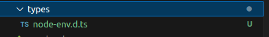

## Getting Started

**1- Create you project :** 

npx create-next-app@latest 


**2- Version requirements:** (to avoid compatibility problem)

```bash
"next": "15.0.4"
```

**2- install package next-auth:**

npm install next-auth


**3- Configure the authOptions with KeycloakProvider for next-auth and initialize route handler.**

Create a file with the following command from the root of the project.

```bash
mkdir -p "src/app/api/auth/[...nextauth]" && touch "src/app/api/auth/[...nextauth]/route.ts"
```


Add the following code to the file created. This will configure Keycloak provider from the environment variables.

```bash 
// src/app/api/auth/[...nextauth]/route.ts
import NextAuth, { AuthOptions } from "next-auth";
import KeycloakProvider from "next-auth/providers/keycloak"
  
export const authOptions: AuthOptions = {
    providers: [
        KeycloakProvider({
            clientId: process.env.KEYCLOAK_CLIENT_ID,
            clientSecret: process.env.KEYCLOAK_CLIENT_SECRET,
            issuer: process.env.KEYCLOAK_ISSUER
        })
    ]
}

const handler = NextAuth(authOptions);
export { handler as GET, handler as POST }
```


**4- Create a file with the following command from the root of project.**
```bash 
mkdir types && touch types/node-env.d.ts
```


Extend the ProcessEnv interface with the following code.

```bash 
// types/node-env.d.ts
declare namespace NodeJS {
  export interface ProcessEnv {
    KEYCLOAK_CLIENT_ID: string
    KEYCLOAK_CLIENT_SECRET: string
    KEYCLOAK_ISSUER: string
  }
}
```
**5- Add the environment variables to a file named ''.env.local''**  
Which will be automatically picked up by the Nextjs server.

```bash 
touch .env.local
```

```bash
KEYCLOAK_CLIENT_ID="nextjs"
KEYCLOAK_CLIENT_SECRET="<client_secret>"
KEYCLOAK_ISSUER="http://localhost:8080/realms/myrealm"
```
- Replace the values **nextjs** with the id client egiste in keycloak interface.
- Replace the values **<client_secret>** with the key generete in keycloak interface in client.

We also need to configure **NEXTAUTH_URL** and **NEXTAUTH_SECRET**. These are essential for configuring of "next-auth". To know more, check the guide. Let’s add following environment variables to **.env.local**.

```bash 
// .env.local
...
...
NEXTAUTH_URL="http://localhost:3000"
```
For NEXTAUTH_SECRET, create a secret by running the following command and add it to .env.local. This secret is used to sign and encrypt cookies.

```bash 
openssl rand -base64 32
```

```bash 
// .env.local
...
...
...
NEXTAUTH_SECRET="<secret generated from previous command>"
```

**6- Add components**

Create a folder in src named **components** 

- create the **login** and **logout** component by creating the following files.

```bash 
mkdir src/components &&  touch src/components/login.tsx && touch src/components/logout.tsx
```
- Add the following contents to **login** and **logout** component.

```bash 
// src/components/login.tsx
"use client";
import { signIn } from "next-auth/react";

export default function Login() {
    return (
        <div
            style={{
                display: "flex",
                justifyContent: "center",
                alignItems: "center",
                height: "100vh",
                backgroundColor: "#f0f0f0"
            }}
        >
            <button
                onClick={() => signIn("keycloak")}
                style={{
                    backgroundColor: "#206fba",
                    color: "#fff",
                    border: "none",
                    padding: "12px 24px",
                    fontSize: "16px",
                    borderRadius: "8px",
                    cursor: "pointer",
                    boxShadow: "0px 4px 6px rgba(0, 0, 0, 0.1)"
                }}
            >
                Sign in with Keycloak
            </button>
        </div>
    );
}

```
```bash
// src/components/logout.tsx
"use client";
import { signOut } from "next-auth/react";

export default function Logout() {
    return (
        <div
            style={{
                display: "flex",
                justifyContent: "center",
                alignItems: "center",
                height: "100vh",
                backgroundColor: "#f0f0f0"
            }}
        >
            <button
                onClick={() => signOut()}
                style={{
                    backgroundColor: "#eda879",
                    color: "#fff",
                    border: "none",
                    padding: "12px 24px",
                    fontSize: "16px",
                    borderRadius: "8px",
                    cursor: "pointer",
                    boxShadow: "0px 4px 6px rgba(0, 0, 0, 0.1)"
                }}
            >
                Sign out of Keycloak
            </button>
        </div>
    );
}
}
```

Let’s do some testing the application.

```bash
npm run dev
```

Go to http://localhost:3000 in browber. You’ll be prompted to sign in with keycloak.


Once you sign in, you will see the name of the account used to sign in, with the logout component.
