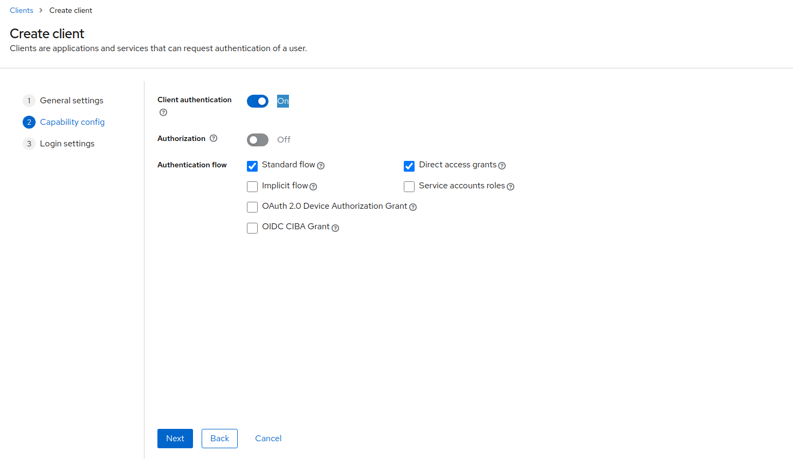

# Setup the Identity provider and describe

## Step 1: Running the Identity Provider

### 1.1 Install Docker (if not installed)
- If Docker is not installed, follow the instructions on the official Docker website to install it.

### 1.2 Start Keycloak with Docker

Create a `docker-compose.yml` file to launch Keycloak in a Docker container.

```bash
keycloak_web:
    image: quay.io/keycloak/keycloak:23.0.7
    container_name: keycloak_web
    environment:
      KC_DB: postgres
      KC_DB_URL: jdbc:postgresql://keycloakdb:5432/keycloak
      KC_DB_USERNAME: keycloak
      KC_DB_PASSWORD: password

      KC_HOSTNAME: keycloack.local
      KC_HOSTNAME_PORT: 8080
      KC_HOSTNAME_STRICT: false
      KC_HOSTNAME_STRICT_HTTPS: false

      KC_LOG_LEVEL: info
      KC_METRICS_ENABLED: true
      KC_HEALTH_ENABLED: true
      KEYCLOAK_ADMIN: admin
      KEYCLOAK_ADMIN_PASSWORD: admin
    command: start-dev
    depends_on:
      - keycloakdb
    ports:
      - 8080:8080

  keycloakdb:
    image: postgres:15
    volumes:
      - postgres-data-keycloak:/var/lib/postgresql/data
    environment:
      POSTGRES_DB: keycloak
      POSTGRES_USER: keycloak
      POSTGRES_PASSWORD: password

volumes:
  postgres-data:
  postgres-data-keycloak:
```
- Accédez à Keycloak sur http://localhost:8080.


## Step 2: Create a Realm/Project in the Identity Provider

### 2.1 Keycloak: Create a Realm
1. **Login to the Admin Console**:
   - Open your browser and navigate to **"Administration Console"**
   - Use the credentials `admin/admin` (or those you have set in the Docker configuration).


   
2. **Create a Realm**:
   - After logging in, click on **Realms** in the left sidebar.
  
   - Click on **Create realm**.
   - Provide a name for your realm (e.g., `myrealm`) and click **Create**.
  
   - A realm in Keycloak is a logical grouping of applications, users, and roles. Each realm is isolated from others.

3. **Configure the Realm**:
   - In the realm settings, you can adjust configurations like login themes, password policies, etc.
   - For instance, you can select the **Login Theme** to customize the appearance of the login page for your users.
  


## Step 3: Configure Clients for Backend and Frontend

#### 3.1.1 Create a Client in Keycloak 
1. **Add a Client**:
   - In the Keycloak admin console, select your realm (`myrealm`).
   - Click on **Clients** in the left sidebar, then click **Create client**.
   
  - Fill in the following fields:
    - **Client Protocol**: OpenID Connect
    - **Client ID**: app
    - **Name** : app
  
    - click on "Next", then activate **Client authentication**
  
   - click "Next", fill in Valid redirect URIs : `http://localhost:3000/api/auth/callback/keycloak`.
    - Valid post logout redirect URIs : `http://localhost:3000`.
  

2. **Save the Client**:
   - Click **Save** to create the client configuration.

3. **Retrieve the Client Secret**:
   - Go to the **Credentials** tab of the client and copy the **Client Secret**. You will need this to configure Flask.


#### 3.1.2 **Create a client for the frontend** :
- Go to the **app1-web**. and adding  the environment variables to a file named **''.env.local''**  

```bash
KEYCLOAK_CLIENT_ID="nextjs"
KEYCLOAK_CLIENT_SECRET="<client_secret>"
KEYCLOAK_ISSUER="http://localhost:8080/realms/myrealm"
```
- Replace the values **nextjs** with the id client egiste in keycloak interface.
- Replace the values **<client_secret>** with the key generete in keycloak interface in client.

We also need to configure **NEXTAUTH_URL** and **NEXTAUTH_SECRET**. These are essential for configuring of "next-auth". To know more, check the guide. Let’s add following environment variables to **.env.local**.


#### 3.1.3 Backend Configuration (Flask)

In your Flask app, you'll need to install the `Flask-OIDC` library and configure it to communicate with Keycloak.

```bash
pip install Flask-OIDC
```
Next, configure your Flask application to communicate with Keycloak.

In your configuration file, for example **config.py**, add the following settings:

```bash
OAUTH_PROVIDERS = [
    {
        'name': 'keycloak',
        'token_key': 'access_token',
        'icon': 'fa-key',
        'remote_app': {
            'client_id': 'app2-client',
            'client_secret': 'RucCUHrjR9zutmQD04p6dWqDH4QcA18R',
            'api_base_url': 'http://localhost:8080/realms/Authentification/protocol/openid-connect/',
            'client_kwargs': {'scope': 'openid email profile'},
            'access_token_url': 'http://localhost:8080/realms/Authentification/protocol/openid-connect/token',
            'authorize_url': 'http://localhost:8080/realms/Authentification/protocol/openid-connect/auth',
            'userinfo_endpoint': 'http://localhost:8080/realms/Authentification/protocol/openid-connect/userinfo',
            'redirect_uri': [
            "http://localhost:7000/*"
        ],
        },
]
```
## Step 4 : Configure Users 

#### 4.1.1 Create a Users in Keycloak 
1. **Add a user**:
 - In the Keycloak admin console, select your realm (`myrealm`).
 - Click on **Users** in the left sidebar, then click **Add user**.
  
- Fill in the following fields:
- Username : `ali`

2. **Save the User**:
   - Click **Save** to create the user configuration.
